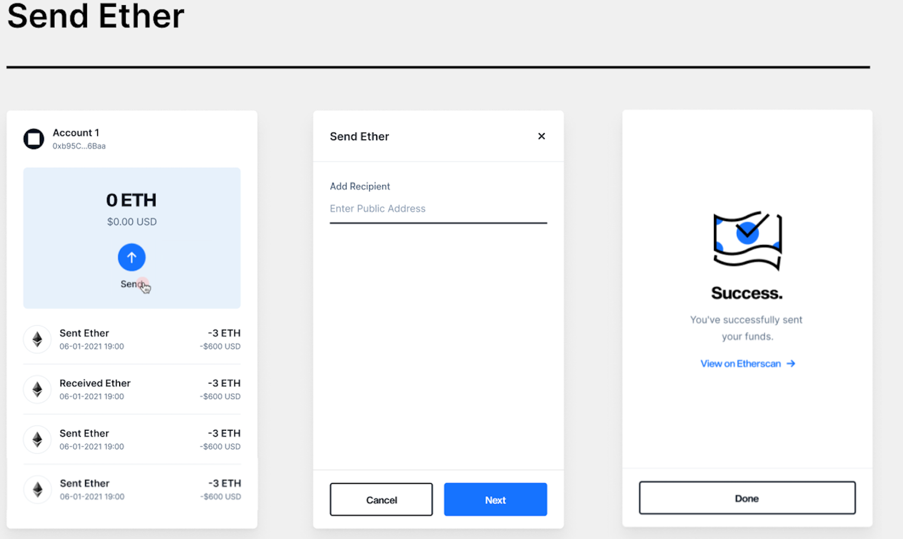

  

  <a href="https://blockwallet.io">
    <picture>
      <source media="(prefers-color-scheme: dark)" srcset="https://user-images.githubusercontent.com/11839151/188500975-8cd95d07-c419-48aa-bb85-4200a6526f68.svg" />
      <source media="(prefers-color-scheme: light)" srcset="https://blockwallet.io/static/images/logo-blockwallet-black.svg" />
      
    </picture>
  </a>

# BlockWallet Code Challenge

React App with TypeScript template

## Task

Build a **mock app** to send ETH (without interacting with any blockchain or wallet) with the given user interface.

### Key points

- Transactions must be **stored and fetched** making use of the `TransactionsService` `addTransaction()` and `getListOfTransactions()` methods
- Past transactions must be *listed* on the **main page**
- You would need to add an **amount to transfer** input field (note: it's not present in the image, styling should be consistent)
- Styling and layout do not have to be necessarily like the provided image

### Steps

- **Fork** the repo into a public Github repository.
- Add the needed **commits** (preferably following a convention) to fulfill the task.
- Push the code to **Github**.
- Send the **public link** and explanations if needed to our team.
- Wait for our feedback :)

**Note: NO backend is needed, this is an entirely front-end task.**

## What will be evaluated?

- Architecture skills.
- React and frontend skills.
- Clean and consistent interface would be a bonus.

## Reference layout

